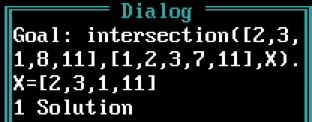
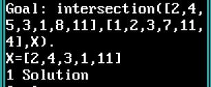
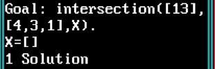
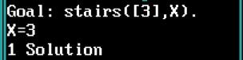
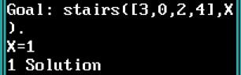
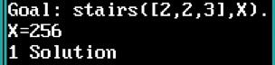

# Лабораторная работа №8. Рекурсивная обработка списков на прологе

## Задание

### Написать базу, для рекурсивной обработки списков в среде Turbo-Prolog. 

#### Варианты заданий взять те же, что и для лабораторной работы №2.

## Задание №1

### Два множества представлены списками. Найти пересечение множеств.

```prolog
domains
	list_int = integer*

predicates
	member(integer, list_int).
	intersection(list_int, list_int, list_int).

clauses
	member(X, [X|_]).
	member(X, [_|T]) :- member(X, T).

	/* пересечение пустого множества с любым множеством = пустое множество */
	intersection([], _, []). 

	/* если голова первого множества принадлежит второму множеству */
	/* то результатом будет множество, образованное головой первого */
	/* множества и хвостом, полученным пресечением хвоста первого множества со вторым множеством */

	intersection([Head|Tail_1], S2, [Head|Tail]):- member(Head, S2), intersection(Tail_1, S2, Tail).

	/* иначе результатом будет множество, полученное объединением */
	/* хвоста первого множества со вторым множеством */

	intersection([Head|Tail_1], S2, S):- not(member(Head, S2)), intersection(Tail_1, S2, S).
```







## Задание №2

### Написать функцию, выполняющую над числовым одноуровневым списком следующую операцию:

```
(A B C ...) —> A^B^C...
```

**Причем последовательное возведение в степень выполняется справа налево.**

```prolog
domains
	list_int = integer*

predicates
	pow(integer, integer, integer).
	stairs(list_int, integer).

clauses

	/* возведение в степень */
	pow(_, 0, Z):- Z = 1.
	pow(X, Y, Z):- Y > 0, Y_ = Y - 1, pow(X, Y_, Z_), Z = Z_ * X.

	/* если на вход поступил список из одного элемента */
	/* то ответ - сам элемент */
	stairs([Head | []], X):- X = Head.

	/* рекурсивно идем до конца списка и собираем степень */
	stairs([Head | Tail], X):- stairs(Tail, K), pow(Head, K, G), X = G.
```





